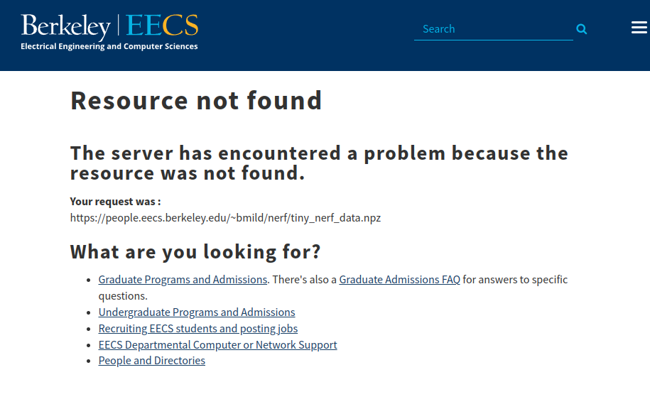

# README

## Tiny NeRF dataset



Originally Tiny NeRF dataset was provided by UC Berkely EECS before. However currently UC Berkely does NOT provide this dataset. I don't know the reason why. So instead of the UC Berkely's link, I will use the UC San Diego's link for a while.

```bash
wget https://cseweb.ucsd.edu//~viscomp/projects/LF/papers/ECCV20/nerf/tiny_nerf_data.npz
```

## References

1. Aritra Roy Gosthipaty, Ritwik Raha (2021). ["3D volumetric rendering with NeRF"](https://keras.io/examples/vision/nerf/) (Keras Tutorials)
2. ["bmild/nerf"](https://github.com/bmild/nerf) (Github Repository)
